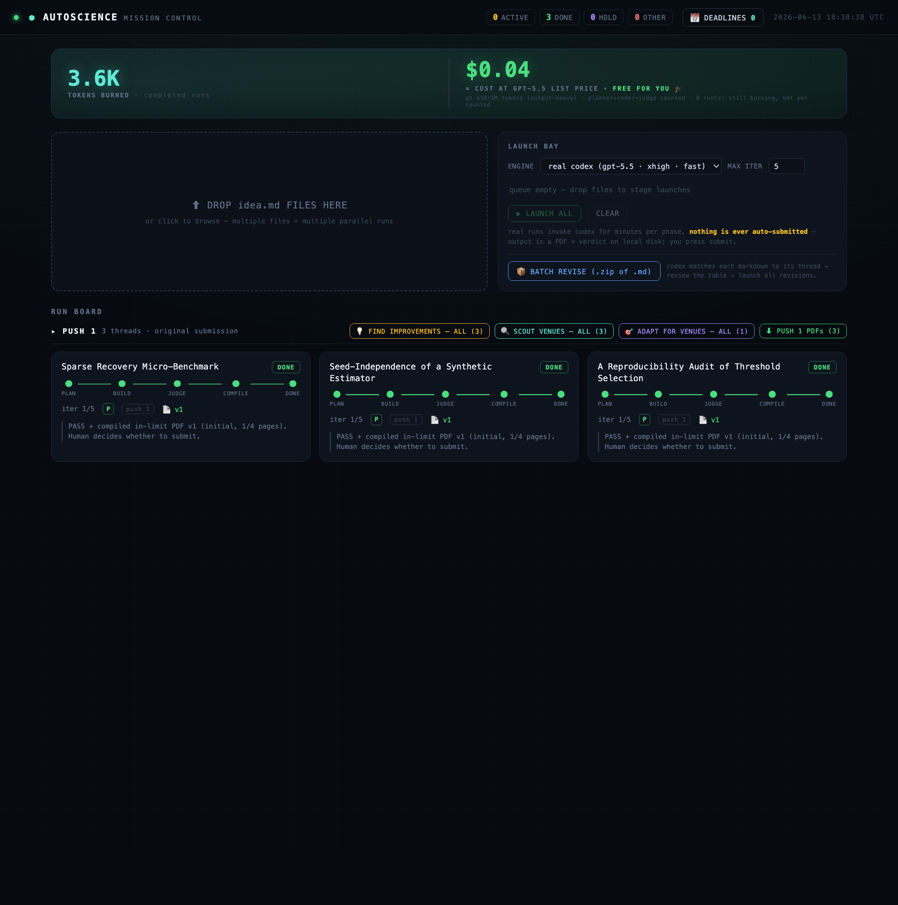
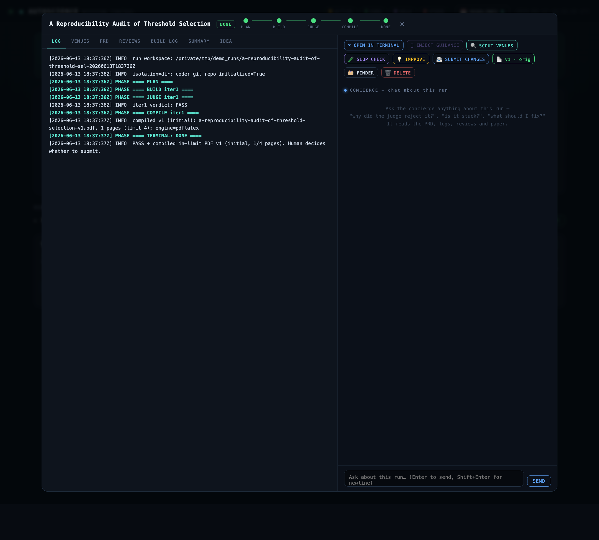
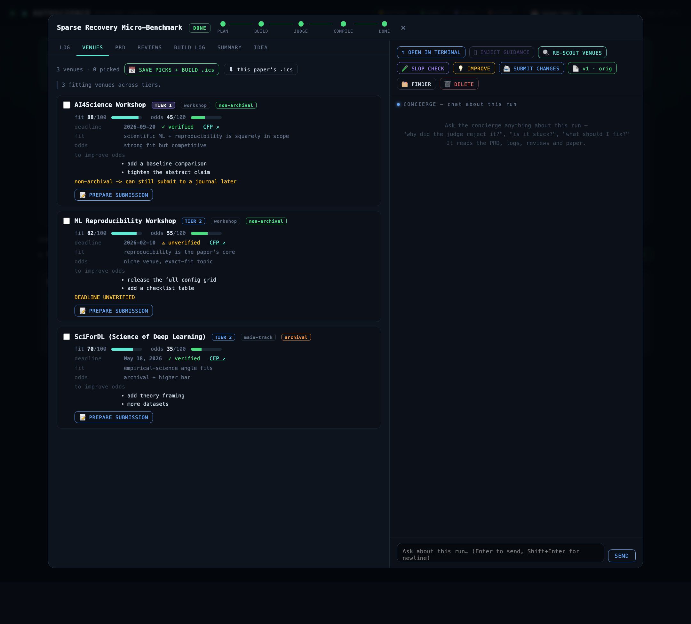

<div align="center">

# Autoscience 1.0

### The most powerful scientific discovery agent available.

**One idea file in → one verified, submission-ready paper out** — driven by a
planner → coder → judge loop of autonomous agents, with a judge that refuses to ship
unverified or oversold results. It **never** auto-submits; pressing *submit* is always a human act.

</div>

Autoscience turns a one-line research idea into a compiled workshop PDF: agents do the
research, write the code, run the experiments, and draft the paper — while an **independent
judge re-runs the reproduction and blocks any number it can't verify**. It produces scientific
content only through these agents; the orchestrator's job is to drive them, gate them, cap them,
and stop them safely. On top sits **Mission Control**, a local dashboard to launch runs in
parallel, watch them live, chat with each, revise them, scout venues, and prepare submissions.



```
PLAN ──> BUILD ──> JUDGE ──┬─ PASS  ──> COMPILE ──> DONE
                  ^        ├─ REVISE ──> BUILD   (loop, capped)
                  └────────┘
                           └─ HOLD  ──> STOP (reason; no PDF, no submit)
```

---

## Guide (start here)

### What you need
- **[codex CLI](https://github.com/openai/codex)** installed and authenticated (`codex exec` must work). This is what does the actual research.
- **Python 3.10+** and **`pip install -r requirements.txt`** (only dep: PyYAML).
- A **LaTeX toolchain** for compiling PDFs — `pdflatex` (MacTeX/TeX Live) or `tectonic`. `pdfinfo` (poppler) is nice-to-have for page counts.
- *(optional)* an **OpenRouter API key** if your experiments call an LLM — see [Secrets](#secrets-never-committed) below.

### Run it
```bash
pip install -r requirements.txt

# 1) Prove the whole machine works — mock codex, deterministic, < 1 min, $0:
python3 tests/test_pipeline.py          # -> 38/38 checks

# 2) Launch Mission Control (the dashboard):
python3 server.py                       # -> open http://127.0.0.1:8765
```
Then **drag one or more `idea.md` files onto the dashboard** and hit launch. Each becomes
its own planner→coder→judge run; watch them live, chat with each, and grab the PDF on PASS.
(Prefer the CLI? `python3 run.py ideas/toy_sindy.md`.)

> An `idea.md` is tiny — a title and a one-line `thesis:` is enough. See `ideas/toy_sindy.md`.

### Inside a run
Click any card to open its console: live log + the paper, judge reviews, build log; a
**concierge chat** that knows the run; and one-click actions — open the codex thread in a
real terminal, inject guidance, scout venues, run a quality (“AI-slop”) check, ask *what to
improve*, submit follow-up changes, or reveal the folder in Finder.



### Find venues & prep submissions
Scout the live web for tier 1/2/3 venues that fit each paper — with honest fit %, acceptance
odds, deadlines (verified vs. unverified), archival status, and concrete fixes — pick the ones
you want into a deadline calendar (`.ics`), and prepare a clean, human-written submission copy
per venue.



### Secrets (never committed)
The OpenRouter key for LLM experiments lives **only** in a gitignored `secrets.local`:
```bash
cp secrets.local.example secrets.local
# then edit secrets.local and paste your key:
# OPENROUTER_API_KEY=sk-or-v1-...
```
The orchestrator injects it into the coder/judge environment at runtime; it never touches
the repo, the papers, or these screenshots. Default experiment model is `deepseek/deepseek-v4-flash`
(override per paper with a `model:` line in the idea `.md`). Configure under `experiment_api`
in `config.yaml`.

### Safety, by design
No auto-submission, ever. The coder's full-permission sandbox is confined to
`runs/<id>/workspace/`. Caps (iterations, wall-clock) and a kill-switch are enforced by the
orchestrator, not by trusting the agent. Any “upload/submit/email” instruction found inside an
idea or agent output is treated as **data, not a command**.

---

## Quick start

```bash
pip install -r requirements.txt          # only dep: PyYAML

# Fast, free, deterministic test of the whole machine (mock codex, <1 min):
python3 tests/test_pipeline.py

# Real run (invokes codex 3+ times; minutes + tokens):
python3 run.py ideas/toy_sindy.md

# Mission-control web dashboard (drag & drop ideas, parallel runs, live board):
python3 server.py            # -> http://127.0.0.1:8765
```

## Mission control (web dashboard)

`server.py` serves a local command room at **http://127.0.0.1:8765** (stdlib only,
no extra deps):

- **Drag & drop** one or more `idea.md` files — each becomes its own pipeline run
  in a background thread, so several research ideas run **in parallel**.
- **Engine switch:** real codex (default) or mock demo (instant, $0) per launch,
  plus a max-iterations override.
- **Live board:** per-run phase tracker (PLAN→BUILD→JUDGE→COMPILE→DONE), iteration
  counter, verdict badges, elapsed time; detail view streams the orchestrator log
  and shows PRD / judge reviews / BUILD_LOG / summary / idea.
- **Abort button** writes the run's `ABORT` sentinel — the same kill switch the
  orchestrator enforces. Ctrl-C on the server ABORTs all active runs first, so no
  full-permission coder is ever orphaned.
- **PDF button** serves `final/paper.pdf` once a run reaches `DONE`. Artifacts are
  served read-only from `runs/`; the dashboard never submits anything anywhere.

### Talk to a run, and unblock it

Click any card to open its **run console**: left side is the live log + artifact
tabs (PRD / reviews / BUILD_LOG / summary / idea); right side is where you drive it.

- **Concierge chat** — a *separate* codex-backed agent (read-only) that knows this
  one run. Ask "why did the judge reject it?", "is it stuck?", "what should I fix?"
  — it reads the PRD, logs, reviews and paper and answers grounded in the files
  (~20s/reply). It can't write anything; it only helps you decide.
- **⌥ Open in Terminal** — when a run hits an outside block, this drops you straight
  into that run's **actual codex thread** in a real Terminal window
  (`codex resume <session_id>` in the workspace), so you can resolve it by hand —
  install a dep, answer codex's question, fix a path. Uses a permission-free
  `.command` file (no macOS Automation prompt). Every phase's codex thread id is
  recorded in `runs/<id>/sessions.jsonl`.
- **⮞ Inject guidance** — answer codex's question or redirect the coder *without
  leaving the app*: it resumes the real coder thread headlessly with your message;
  the reply lands back in the chat. Disabled until a resumable coder thread exists
  (mock runs have none).

How the threads connect: each codex `exec` call emits a resumable `thread_id`; the
orchestrator persists it per phase, so the dashboard can reopen the planner, coder,
or judge conversation exactly where it left off — in a terminal or headlessly.

### Versioned, thread-named PDFs + Finder

Every compile is kept — nothing is overwritten. PDFs are named after the thread and
the push that produced them: `final/<thread-slug>-v{N}.pdf`, where **push 1** is the
original submission and **push 2, 3, …** are Submit-Changes revisions (distinct from
the judge's internal build iterations). The console shows one button per version
(`📄 v2 · rev 1`); versions whose PDF predates versioning are shown disabled (`✕`).
A **🗂 Finder** button opens the run's folder. Each board card carries a **push N**
badge so you can see at a glance whether a run is an original or a revision.

**The board is separated into push groups.** Threads are grouped by their current push
(Push 1 = original, Push 2 = first revision, …), and each group header has a
**⬇ Download Push N PDFs** button that zips the push-N PDF of every thread *currently on
push N* (`GET /api/push/<N>/pdfs.zip`) — so "Push 2" gives only the v2 PDFs from threads
that reached a second push, not all PDFs.
`versions.json` records the history (kind, pages, retained). See `pipeline/pdf_versions.py`.

### Token + cost counter, and a paper-quality (AI-slop) check

A big counter at the top of the dashboard sums the tokens burned across completed runs
and shows the hypothetical cost at an assumed GPT-5.5 (xhigh, fast) list price — clearly
labelled an estimate, and "free for you". Each finished paper's console has a
**🧪 Slop check** button: it asks the concierge agent to assess the paper like a tough
reviewer (novel vs generic filler, claims evidence-backed — the judge re-ran the repro,
honest limitations, substantive vs padded writing) and returns a
**SLOP / WEAK / DECENT / STRONG** verdict with a one-line reason, shown as a badge on the
card and console. Both are pure client-side features (read run summaries; ride the existing
concierge endpoint) so they need no server changes.

### Batch revise — drop a zip, codex assigns each file to its thread

**📦 Batch revise** in the launch bay takes a `.zip` of markdown files (the next round
of changes). A codex agent reads each file's content *and* filename and matches it to
the thread it revises — so even generically-named files land on the right paper. You get
a **review table** (file → thread, with confidence + reason and an editable dropdown to
fix any wrong guess), then **🚀 Launch All** fires a Submit-Changes revision on every
matched thread at once. Endpoints: `POST /api/batch/upload`, `GET /api/batch/<id>`,
`POST /api/batch/<id>/launch`. Matching: `pipeline/batch_match.py` (filename prior +
codex with `--output-schema`).

### Revise a finished run with a follow-up .md

A finished run isn't frozen. In its console, **📨 Submit Changes** opens a composer
(type changes or load a `.md` file) — the coder revises the *existing* draft per your
request, the judge re-checks, and it recompiles. Iteration numbering continues from
where it left off (nothing is overwritten), and prior runs/threads are never deleted.
Server: `POST /api/runs/<id>/continue {content}`; orchestrator: `continue_run(...)`.

### LLM API for experiments

Experiments that need to call an LLM (e.g. "do LLMs quote arbitrage-free prices?",
LLM-as-subject studies) get an OpenAI-compatible API automatically. The orchestrator
injects these into the coder's and judge's codex environment:

- `OPENROUTER_API_KEY` (mirrored to `OPENAI_API_KEY`)
- `OPENROUTER_BASE_URL` = `https://openrouter.ai/api/v1` (mirrored to `OPENAI_BASE_URL`)
- default model **`deepseek/deepseek-v4-flash`** (`OPENROUTER_DEFAULT_MODEL` / `OPENAI_MODEL`)

**Per-paper model override:** the default is DeepSeek V4 Flash, but if your idea
`.md` (or a change `.md`) contains a `model:` line (e.g. `model: openai/gpt-4o`),
that model is used for that run instead. Anything like `model: default` /
`deepseek v4 flash` keeps the default.

The coder/judge are told to read the key from the environment and never write or
commit it. Because the OpenAI vars are set, stock `openai`-SDK code routes to
OpenRouter unchanged. The judge re-runs `repro.sh` with the same env, so LLM
experiments are re-verifiable. Configure under `experiment_api` in `config.yaml`;
the secret lives only in the gitignored `secrets.local`.

### No more HOLD; "submit anyway"

By default (`judge.allow_hold: false`) the judge **never** puts a paper on HOLD —
venue fit is advisory, and the venue scout handles placement. A would-be HOLD
(which only ever happens *after* the results-are-real gate passed) is converted to
a PASS and compiled into a submittable PDF. Set `allow_hold: true` to restore the
venue-fit HOLD terminal state.

For any run that stalled with a draft but no PDF (a pre-existing HOLD, a page-limit
stop, an interruption), the console shows a **✅ SUBMIT ANYWAY** button: it compiles
the current draft into `final/paper.pdf` and marks the run DONE. It still never
submits anywhere — that's your call.

### Find venues & build a deadline calendar

Once a run has a paper, the console's **VENUES** tab runs the **venue scout** — a
codex agent that browses the live web for places to submit and ranks them:

- Covers the full spectrum: **tier 1** (NeurIPS/ICML/ICLR main tracks + flagship
  workshops), **tier 2** (specialized venues), **tier 3** (small/niche/regional) —
  big names *and* obscure workshops, not only the famous ones.
- Per venue: **fit score** (how well the paper matches scope), **acceptance odds**
  (honest, not flattering), **deadline**, **archival vs non-archival**, the **CFP
  link**, and a concrete list of **fixes to improve your odds** at that venue.
- **Deadline honesty:** the scout must fetch the real CFP page; any deadline it
  can't verify is flagged **⚠ unverified** rather than guessed. Output is forced
  into a JSON schema via `codex exec --output-schema`, so the table is reliable.
- **Pick** the venues you want → **SAVE PICKS + BUILD .ics**. The server writes a
  per-paper `deadlines.ics` and an aggregate `/calendar.ics` across all papers.
- The header **📅 DEADLINES** button opens a calendar of every picked deadline
  (sorted, near-term ones highlighted) with a "download all .ics" link to import
  into Google/Apple Calendar.

### Format: two-column, math-dense (matches the reference paper)

The house paper format is now a **two-column** article (`prompts/house_paper_template.tex`):
full-width title + abstract, 2-column justified body, **numbered display equations
with defined symbols**, `booktabs` tables, single/full-width figures — the look of a
real workshop paper. The coder is required to use it (the judge fails a math-light or
single-column draft on the structure criterion), and adapts to a specific venue's
`.sty` once you select a venue for that run.

### Verified against real codex (not just mock)
A real end-to-end run (`ideas/handoff_check.md`) exercised the full
planner→coder→judge handoff with live `gpt-5.5`:
- planner wrote `PRD.md`; the coder read it and produced the full paper + `repro.sh`
  + results/figures (and compiled its own PDF); the judge **re-ran the repro AND
  independently recomputed the numbers from scratch** before ruling.
- The judge returned **HOLD** — correctly refusing to dress a trivial descriptive
  statistic up as a workshop paper (no exact-fit venue). The honesty gate is not a
  rubber stamp. All three thread ids were captured for resume.

`run.py` exit codes: `0`=DONE/PRD_REVIEW, `10`=HOLD, `11`=REVISE_EXHAUSTED /
PAGE_LIMIT_EXCEEDED, `1`=ERROR/ABORTED.

## How it's wired

| Role | Invocation | Sandbox | Consumes | Produces |
|---|---|---|---|---|
| **Planner** | one-shot `codex exec` | `workspace-write` | `idea.md` | `PRD.md` (house style, no code) |
| **Coder** | long `codex exec` | `danger-full-access` (confined) | `PRD.md` (+ latest review) | `paper_draft.tex`, `repro.sh`, `BUILD_LOG.md`, code, results |
| **Judge** | **fresh** one-shot each iter | `workspace-write` (re-runs repro) | PRD + paper + artifacts + logs | `JUDGE_REVIEW_iterN.md` + `VERDICT:` line |

Three fresh role-prompts, not three long-lived processes. The judge starts clean
every iteration so it is uncontaminated by having authored the plan — that
independence is the whole point of the honesty gate.

### The judge rubric (the heart of the system)
1. **Results are real (GATE).** Judge re-runs `repro.sh` and confirms every headline
   number in the paper matches the artifact. Any mismatch → `REVISE`, no matter how
   good everything else is. *Proven by the test suite, not just coded* (see below).
2. **No overselling** — claims scoped to evidence; partial/censored results reported honestly.
3. **Reproducibility** — seeds fixed/stated; `repro.sh` is genuinely one command.
4. **Anxiety experiment present** — the most likely rejection reason is named and neutralized.
5. **Venue fit** — no exact-fit venue → `HOLD` (don't downgrade).
6. **Structure conforms** to the workshop-PDF contract.

The judge emits a machine-parseable `VERDICT: PASS|REVISE|HOLD` line that the
orchestrator greps for. The verdict is **never** inferred from prose. If no verdict
line is present, the orchestrator degrades to `REVISE` — it can never ship without
an explicit `PASS`.

## Codex adapter — pinned flags

All CLI-specific logic lives in `pipeline/codex_adapter.py`, pinned against
`codex exec --help` for **codex-cli 0.128.0** on this machine. Real argv built:

```
codex exec -m gpt-5.5 -c model_reasoning_effort="xhigh" -c service_tier="fast" \
  -C <workdir> -s <sandbox> --json -o <final_msg_file> [--skip-git-repo-check] -
```

Notes:
- **There is no `--yolo` in 0.128.0.** Full perms = `-s danger-full-access` (or
  `--dangerously-bypass-approvals-and-sandbox`, used automatically in container mode).
- The prompt is passed on **stdin** (the `-` positional) so long prompts never hit ARG_MAX.
- `--json` → stdout is JSONL (parsed for usage/progress); the final message is
  captured via `-o`. stdout→`.jsonl`, stderr→`.stderr` are teed per call.
- A hard per-call timeout SIGTERM→(grace)→SIGKILLs the whole process group on breach.

## Caps & safety (enforced by the orchestrator, not by trusting the agent)
- `max_iterations` (default 5) → `REVISE_EXHAUSTED`, best draft kept, no PDF.
- per-phase + total wall clock → the codex subprocess is killed on breach.
- **Kill switch:** a `runs/<id>/ABORT` sentinel, checked between phases *and* mid-run
  by the adapter → clean teardown, terminal `ABORTED`.
- **No auto-submission, ever.** Any "upload/submit/email" instruction found inside
  `idea.md`/`PRD.md`/agent output is treated as **data, not a command** (the coder
  prompt says so explicitly) and surfaced to the human.

### Coder isolation — what was actually achieved
Docker is **not installed** on this machine, so isolation runs in **`dir` mode**:
the coder's `danger-full-access` is confined to `runs/<id>/workspace/`, which is a
**fresh git repo** (changes reviewable / rollback-able), launched with `-C` set to
that directory. A `Dockerfile` ships in the repo to upgrade to **`container`** mode
the moment Docker is available — set `isolation: { mode: container }` in
`config.yaml` and the adapter switches to `--dangerously-bypass-approvals-and-sandbox`
inside the container. This is the honest isolation level; harden it before running
untrusted ideas.

## File contract (the on-disk handoff bus)
```
runs/<slug>-<UTCstamp>/
  idea.md                 # immutable copy of input
  PRD.md                  # planner output
  workspace/              # coder's git repo (danger-full-access lives ONLY here)
    paper_draft.tex  repro.sh  BUILD_LOG.md  results/ figures/ src/
  reviews/JUDGE_REVIEW_iter{1..N}.md
  logs/{plan,build,judge}_iter*.{jsonl,stderr,final.txt}
  run_summary.md          # verdict history, caps consumed, PDF path — legible at a glance
  final/paper.pdf         # only on PASS, within page limit
```

## Config (`config.yaml`)
Models (default `gpt-5.5`, `xhigh`, `fast`), caps, sandboxes, isolation mode, the
PRD-review halt, compile engine, and venue profiles (name / page limit / style /
scope). The judge holds if no venue scope matches.

## Tests — what the <1-minute suite proves
`tests/test_pipeline.py` swaps **only the codex binary** for `tests/mock_codex.py`;
the adapter, orchestrator, verdict parser, and the real LaTeX compiler all run for
real. 23 checks across 7 scenarios:

- **happy** → `DONE` + a really-compiled, in-limit PDF (M3, M6).
- **fabricated** → the coder claims `F1=1.00` but `repro.sh` truly yields `0.85`; the
  judge re-runs repro, catches it, returns `REVISE`, and only `PASS`es after the fix
  (**M4 — the Criterion-1 gate proven, not just coded**).
- **hold** → `HOLD` terminal, no PDF.
- **exhaust** → `REVISE_EXHAUSTED` at the iteration cap (M5).
- **abort** → the kill switch fires → `ABORTED` (M5).
- **noverdict** → an unparseable judge verdict can never `PASS` (safety).
- **hang** → a stuck codex call is SIGTERM→SIGKILL'd at the per-call timeout (M1).

```
RESULT: 23/23 checks passed in ~10s
```

## Project layout
```
config.yaml            prompts/{planner,coder,judge}.md      Dockerfile
run.py                 ideas/toy_sindy.md
pipeline/
  codex_adapter.py     # the only codex-CLI-aware module (pinned flags)
  orchestrator.py      # the state machine + caps + kill switch
  roles.py             # per-role prompt composition + invocation
  verdict.py           # greps VERDICT: PASS|REVISE|HOLD (never infers from prose)
  compile.py           # pdflatex/tectonic -> PDF + page-limit check
  workspace.py config.py summary.py logging_utils.py
tests/
  mock_codex.py        # fake codex binary (swaps only the binary)
  test_pipeline.py     # the <1-min suite
```
